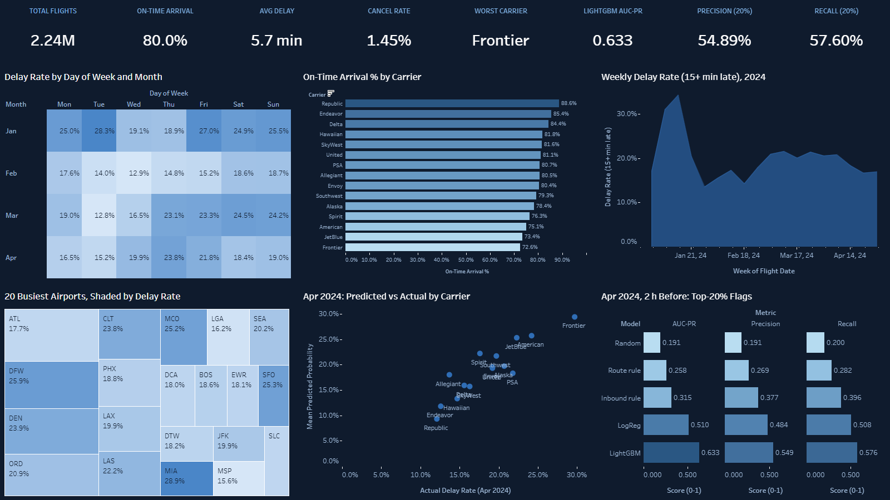

# US Flight Delay Prediction, 2 Hours Before Departure

Predicts whether a US domestic flight will arrive 15+ minutes late, using only information known **2 hours before its scheduled departure**: the inbound aircraft's progress, airport congestion and weather. Built on 2.24 million real flights (BTS On-Time Performance, January-April 2024) with an end-to-end pipeline: Airflow, Great Expectations, dbt, PostgreSQL, LightGBM, and Excel and Tableau dashboards generated from code.

[](https://public.tableau.com/app/profile/palaksh.chaturvedi/viz/Flight_Delays_17909481309690/USFlightDelaysandDelayModelJan-Apr2024)

**[Open the interactive dashboard on Tableau Public](https://public.tableau.com/app/profile/palaksh.chaturvedi/viz/Flight_Delays_17909481309690/USFlightDelaysandDelayModelJan-Apr2024)**

## Results (April 2024 test month, scored once)

| Model | AUC-PR | Precision / recall (riskiest 20% flagged) |
|---|---|---|
| **LightGBM** | **0.633** | **0.549 / 0.576** |
| Logistic regression | 0.510 | 0.484 / 0.508 |
| Inbound-delay rule ("the plane is already late") | 0.315 | 0.377 / 0.396 |
| Random (no skill) | 0.191 | 0.191 / 0.200 |

- AUC-ROC 0.809. Probabilities are well calibrated (Brier 0.108 vs 0.154 for a constant).
- LightGBM beats logistic regression by +0.123 AUC-PR (paired day-block bootstrap, 95% CI +0.114 to +0.133).
- Time-based design: January is history only, fit on February, every choice validated on March, refit on February-March, April scored once.

**Known weak spots, stated plainly:**
- Destination weather is the *observed* weather, not a forecast (it adds only +0.005 AUC-PR on validation).
- BTS tail numbers record same-day aircraft swaps after the fact; excluding flights with that signature lowers AUC-PR to 0.594.

## Pipeline

```
BTS monthly zips + OurAirports + Open-Meteo weather (cached)
  -> ingest (COPY, 200k-row chunks) -> Great Expectations (22 hard gates)
  -> dbt (UTC timelines, previous leg of the same aircraft; 66 tests)
  -> 34 features known 2 h before departure -> leakage check (fails the run on any violation)
  -> LightGBM vs logistic regression vs rules -> Excel + Tableau dashboards
```

12 Airflow tasks, triggered by hand. Stack: Docker Compose, Airflow 2.9.3, PostgreSQL 15, Great Expectations 0.18.19, dbt 1.7.13, LightGBM, SHAP, openpyxl, Tableau Hyper API.

## Run it

```
cp .env.example .env            # set POSTGRES_PASSWORD and HOST_PROJECT_DIR (this folder, forward slashes)
docker compose up -d --build    # Postgres :5436, Airflow UI http://localhost:8085
docker compose exec airflow-scheduler airflow dags trigger flight_delay_pipeline_dag
```

- The BTS zips (about 105 MB) are downloaded automatically on the first run; the weather is cached in `data/raw/weather/`, so no API calls are needed.
- A full run takes about 25 minutes and fits a 4 GB Docker memory limit (8 GB laptop). If `train_delay_model` runs out of memory, stop `airflow-webserver` and re-run that task.
- The Airflow login is set in `docker-compose.yml` and is for local use only.

## More detail

[README_PIPELINE.md](README_PIPELINE.md) has the full architecture, every design decision, the audit fixes (with before and after numbers) and the verified run evidence.

Data: US Bureau of Transportation Statistics On-Time Performance (public domain); OurAirports (public domain); Open-Meteo historical weather API.
